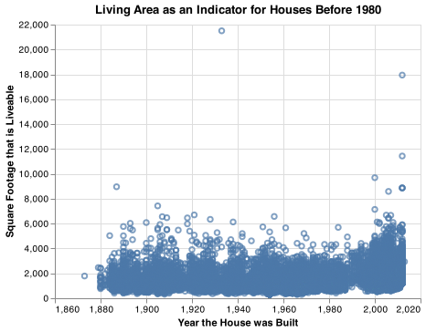
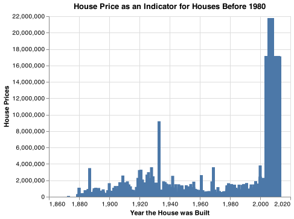
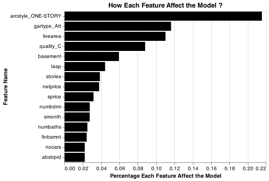
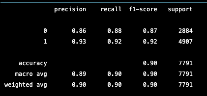

#   Predicting Houses Built Before 1980
  
__Lucas Soto__
  
   
##  Elevator pitch
  
The main purpose of this project is to create a model that is able to predict if a house was built before 1980.  I used the data from the state of Colorado. Also, I used a Tree Decision Classifier model for this project. 

## Sample Data View


|    | parcel           |   abstrprd |   livearea |   finbsmnt |   basement |   yrbuilt |   totunits |   stories |   nocars |   numbdrm |   numbaths |   sprice |   deduct |   netprice |   tasp |   smonth |   syear |   condition_AVG |   condition_Excel |   condition_Fair |   condition_Good |   condition_VGood |   quality_A |   quality_B |   quality_C |   quality_D |   quality_X |   gartype_Att |   gartype_Att/Det |   gartype_CP |   gartype_Det |   gartype_None |   gartype_att/CP |   gartype_det/CP |   arcstyle_BI-LEVEL |   arcstyle_CONVERSIONS |   arcstyle_END UNIT |   arcstyle_MIDDLE UNIT |   arcstyle_ONE AND HALF-STORY |   arcstyle_ONE-STORY |   arcstyle_SPLIT LEVEL |   arcstyle_THREE-STORY |   arcstyle_TRI-LEVEL |   arcstyle_TRI-LEVEL WITH BASEMENT |   arcstyle_TWO AND HALF-STORY |   arcstyle_TWO-STORY |   qualified_Q |   qualified_U |   status_I |   status_V |   before1980 |
|---:|:-----------------|-----------:|-----------:|-----------:|-----------:|----------:|-----------:|----------:|---------:|----------:|-----------:|---------:|---------:|-----------:|-------:|---------:|--------:|----------------:|------------------:|-----------------:|-----------------:|------------------:|------------:|------------:|------------:|------------:|------------:|--------------:|------------------:|-------------:|--------------:|---------------:|-----------------:|-----------------:|--------------------:|-----------------------:|--------------------:|-----------------------:|------------------------------:|---------------------:|-----------------------:|-----------------------:|---------------------:|-----------------------------------:|------------------------------:|---------------------:|--------------:|--------------:|-----------:|-----------:|-------------:|
|  0 | 00102-08-065-065 |       1130 |       1346 |          0 |          0 |      2004 |          1 |         2 |        2 |         2 |          2 |   100000 |        0 |     100000 | 100000 |        2 |    2012 |               1 |                 0 |                0 |                0 |                 0 |           0 |           0 |           1 |           0 |           0 |             0 |                 1 |            0 |             0 |              0 |                0 |                0 |                   0 |                      0 |                   0 |                      1 |                             0 |                    0 |                      0 |                      0 |                    0 |                                  0 |                             0 |                    0 |             1 |             0 |          1 |          0 |            0 |
|  1 | 00102-08-073-073 |       1130 |       1249 |          0 |          0 |      2005 |          1 |         1 |        1 |         2 |          2 |    94700 |        0 |      94700 |  94700 |        4 |    2011 |               1 |                 0 |                0 |                0 |                 0 |           0 |           0 |           1 |           0 |           0 |             1 |                 0 |            0 |             0 |              0 |                0 |                0 |                   0 |                      0 |                   1 |                      0 |                             0 |                    0 |                      0 |                      0 |                    0 |                                  0 |                             0 |                    0 |             1 |             0 |          1 |          0 |            0 |
|  2 | 00102-08-078-078 |       1130 |       1346 |          0 |          0 |      2005 |          1 |         2 |        1 |         2 |          2 |    89500 |        0 |      89500 |  89500 |       10 |    2010 |               1 |                 0 |                0 |                0 |                 0 |           0 |           0 |           1 |           0 |           0 |             1 |                 0 |            0 |             0 |              0 |                0 |                0 |                   0 |                      0 |                   0 |                      1 |                             0 |                    0 |                      0 |                      0 |                    0 |                                  0 |                             0 |                    0 |             1 |             0 |          1 |          0 |            0 |
### Finding Relationships 
  
####  Two charts that evaluate potential relationships between some home variables and the before1980 variable.
  
I decided to created two charts using variables that could show some relationhip with the target.I found that there is not relevant information or relatioship between the livinarea and before1980 variables. We can observe that the distribution is very similar for all the years with some exeption after the 2000 year where there are some outliers. 
The second graph, the selling price variable does not show relevant relevant information neither. We can observe that the before the 2000 year most of the houses prices are below $2 million.
  
#####  TECHNICAL DETAILS
  
  
```python
## First graph
graph=(alt.Chart(dwellings_ml).encode(
    x=alt.X('yrbuilt', scale=alt.Scale(zero=False),axis=alt.Axis(title='Year the House was Built')),
    y=alt.X('livearea', axis=alt.Axis(title='Square Footage that is Liveable'))
  
).mark_point().properties(title="Living Area as an Indicator for Houses Before 1980")
)
  
graph.save('graph1.png')
  
## Second graph
graph2=(alt.Chart(dwellings_ml).encode(
    x=alt.X('yrbuilt',scale=alt.Scale(zero=False),axis=alt.Axis(title="Year the House was Built")),
    y=alt.X('netprice', axis=alt.Axis(title="House Prices"))
).mark_bar().properties(title=" House Price as an Indicator for Houses Before 1980")
)
graph2.save("graph2.png")
```
  

  

  
  
  
###  GRAND QUESTION 2
  
####  Classification Model with 90% ocurracy. 
  
The first part for building this model is to split the data into two parts, the target and the features that will help us predict our target. 
The second part is to split again the data into the training and the test data. I have chosen to use a test size of 0.34. It means that 66% of the data will be use to train the model and 34% will be use to test the model. 
Finally, I use the  deicision tree classifier model because the featueres are categorical and discrete. This model works better with these type of features.
 
#####  TECHNICAL DETAILS
  
  
```python
x=dwellings_ml.drop(['yrbuilt','parcel', 'before1980'],axis=1)
y=dwellings_ml.filter(['before1980' ], axis=1)
  
#%%
X_train, X_test, y_train, y_test= train_test_split(
    x,
    y,
    test_size=0.34,
    random_state= 76
)
#%%
clf=tree.DecisionTreeClassifier(criterion="entropy", random_state= 0)
clf.fit(X_train,y_train)
y_predictions=clf.predict(X_test)
#%%
##looking at the accuraency of the test
metrics.accuracy_score(y_test, y_predictions)
  
```
###  Detailing most Important features in the Model
  
#### The following chart show the feature with most influence in the model.
  
  
#####  TECHNICAL DETAILS
  
  
```python
df_features = pd.DataFrame(
    {'f_names': X_train.columns,
    'f_values': clf.feature_importances_}).sort_values('f_values', ascending = False)
  
df_features_top= df_features.query('f_values > 0.02')
df_features_top
  
variablesChart = alt.Chart(df_features_top).mark_bar(color='black').encode(
    x=alt.X('f_values', axis=alt.Axis(title='Percentage Each Feature Affect the Model')),
    y=alt.Y('f_names', axis= alt.Axis(title='Feature Name'),sort='-x')
).properties(
    title='How Each Feature Affect the Model ?'
  
)
variablesChart.save("variable.png")
  
```
  

  
  
  
###  GRAND QUESTION 4
  
#### The quality of the classification model using evaluation metrics
  
The first and simple way to evaluate the performance of the method is Accuracy. This is the total amount of correct predictions divided by the total amount of data points. In this case the accuracy is 0.90.
Another useful tool we have is Precision. This is ability of the model to indetify the  only the relevant data points. It is calculate by dividing the number of true positivies by the sum of the number of true positives with the number of false positives. In this case the precision is 0.93.   
  

  
  
```python
print(classification_report(y_test,y_predictions))
  
```
  

  
  
  
  
  
 
  
  
  
  
##  APPENDIX A (PYTHON CODE)
  
```python
  
#%%
import pandas as pd 
import numpy as np
import seaborn as sns
import altair as alt
#%%
# the from imports
from sklearn.model_selection import train_test_split
from sklearn import tree
from sklearn.naive_bayes import GaussianNB
from sklearn.ensemble import GradientBoostingClassifier
from sklearn import metrics
from sklearn.ensemble import RandomForestClassifier
from sklearn.tree import DecisionTreeClassifier
from sklearn.metrics import classification_report
alt.data_transformers.enable('json')
#%%
  
#reading and importing the data. 
  
dwellings_ml = pd.read_csv("https://github.com/byuidatascience/data4dwellings/raw/master/data-raw/dwellings_ml/dwellings_ml.csv")
  
dwellings_ml.head(5)
  
#%%
  
graph=(alt.Chart(dwellings_ml).encode(
    x=alt.X('yrbuilt', scale=alt.Scale(zero=False),axis=alt.Axis(title='Year the House was Built')),
    y=alt.X('livearea', axis=alt.Axis(title='Square Footage that is Liveable'))
  
).mark_point().properties(title="Living Area as an Indicator for Houses Before 1980")
)
  
graph.save('graph1.png')
# %%
graph2=(alt.Chart(dwellings_ml).encode(
    x=alt.X('yrbuilt',scale=alt.Scale(zero=False),axis=alt.Axis(title="Year the House was Built")),
    y=alt.X('netprice', axis=alt.Axis(title="House Prices"))
).mark_bar().properties(title=" House Price as an Indicator for Houses Before 1980")
)
graph2.save("graph2.png")
  
## building a clasification model
#%%
## set the variables
x=dwellings_ml.drop(['yrbuilt','parcel', 'before1980'],axis=1)
y=dwellings_ml.filter(['before1980' ], axis=1)
  
#%%
X_train, X_test, y_train, y_test= train_test_split(
    x,
    y,
    test_size=0.34,
    random_state= 76
  
)
  
#%%
clf=tree.DecisionTreeClassifier(criterion="entropy", random_state= 0)
clf.fit(X_train,y_train)
y_predictions=clf.predict(X_test)
#%%
##looking at the accuraency of the test
metrics.accuracy_score(y_test, y_predictions)
#%%
#ANSWER QUESTION 3
##this shows what variables have most impact in the test. 
df_features = pd.DataFrame(
    {'f_names': X_train.columns,
    'f_values': clf.feature_importances_}).sort_values('f_values', ascending = False)
  
df_features_top= df_features.query('f_values > 0.02')
df_features_top
  
#%%
## now creates a graph to show how each variable affected the test. 
##WHY ALL MY GRAPHS DONT WORK ?
  
variablesChart = alt.Chart(df_features_top).mark_bar(color='black').encode(
    x=alt.X('f_values', axis=alt.Axis(title='Percentage Each Feature Affect the Model')),
    y=alt.Y('f_names', axis= alt.Axis(title='Feature Name'),sort='-x')
).properties(
    title='How Each Feature Affect the Model ?'
  
)
variablesChart.save("variable.png")
#%%
metrics.plot_roc_curve(clf, X_test, y_test)
  
#%%
#ASWER QUESTION 4
print(classification_report(y_test,y_predictions))
  
#%%
  
```
  
